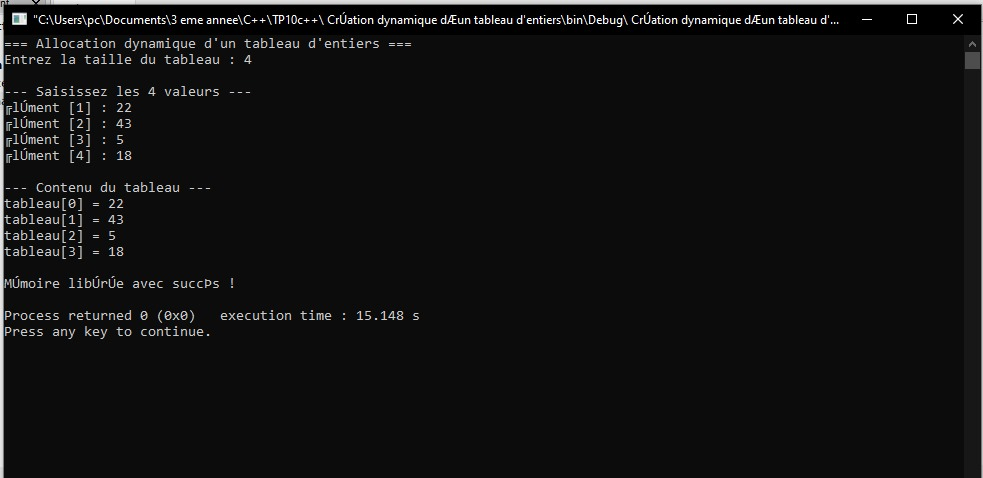
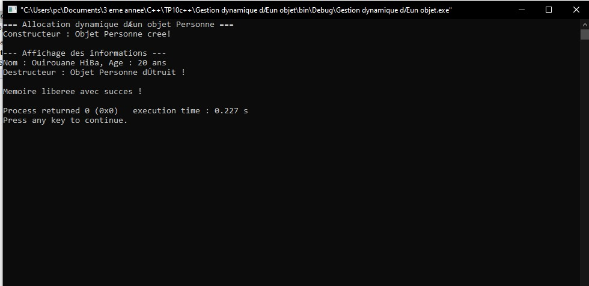
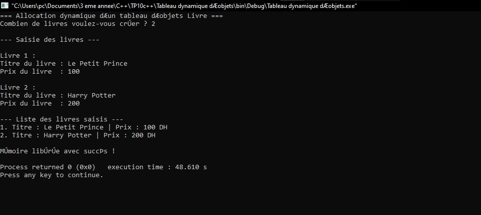
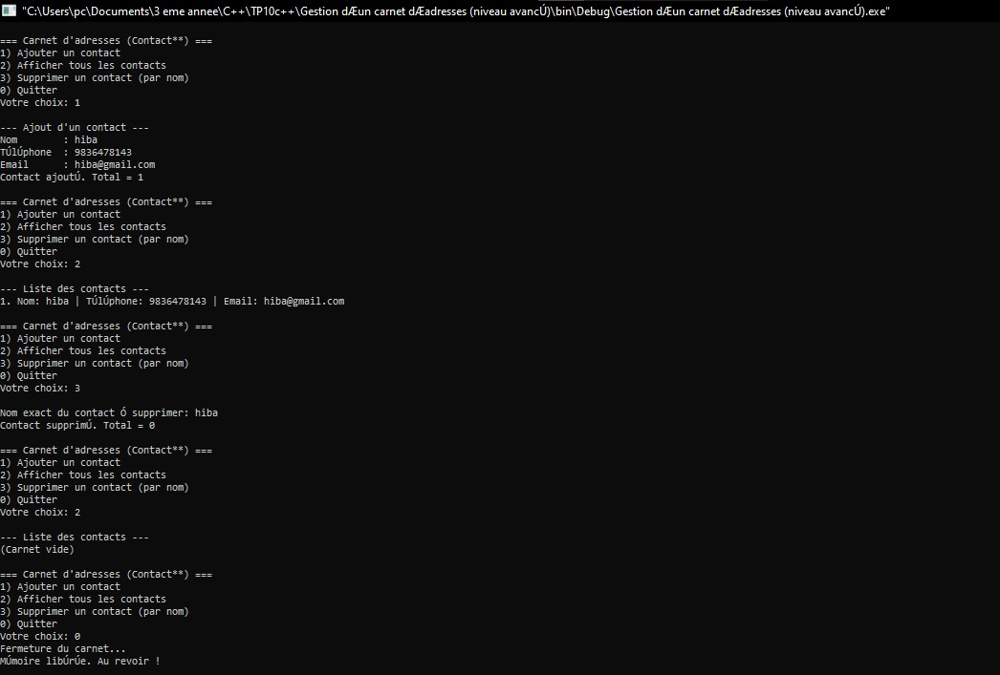

# 💾 TP10 — Gestion dynamique de la mémoire et pointeurs

## 🎯 Objectifs pédagogiques
Ce TP a pour but de comprendre **l’allocation dynamique de la mémoire en C++** et la manipulation de **pointeurs**, d’abord sur des types simples (entiers), puis sur des objets.  
L’étudiant apprendra à :
- Allouer et libérer la mémoire avec `new` et `delete`.
- Gérer des tableaux dynamiques (`new[]`, `delete[]`).
- Utiliser des pointeurs vers objets (`->`).
- Éviter les fuites mémoire.
- Manipuler des pointeurs de pointeurs (`Contact**`).

---


## 📁 Structure du projet

```` bash

TP10/
│
├─Création dynamique d’un tableau d'entiers/
│ └── main.cpp
│
├── Gestion dynamique d’un objet/
│ └── main.cpp
│
├── Tableau dynamique d’objets/
│ └── main.cpp
│
└── Gestion d’un carnet d’adresses (niveau avancé)/
└── main.cpp
````
## 🧩 Exercice 1 — Création dynamique d’un tableau d’entiers

### Énoncé :
- Demander à l’utilisateur la taille du tableau.
- Allouer dynamiquement le tableau avec `new`.
- Saisir et afficher les valeurs.
- Libérer la mémoire avec `delete[]`.

### Objectif :
Maîtriser l’allocation dynamique et la libération de mémoire.


Résultat visuel
<div align="center">  <p><em>Figure 1</em></p> </div>

## 🧠 Exercice 2 — Gestion dynamique d’un objet

### Énoncé :
Créer une classe `Personne` avec `nom` et `age`.  
Allouer un objet dynamiquement avec `new`, puis le détruire avec `delete`.

### Objectif :
Comprendre les pointeurs sur objets et l’usage du constructeur/détruireur.


Résultat visuel
<div align="center">  <p><em>Figure 2</em></p> </div>
## 📚 Exercice 3 — Tableau dynamique d’objets

### Énoncé :
Créer une classe `Livre` (titre, prix).  
Demander combien de livres créer, allouer dynamiquement un tableau d’objets `Livre`, remplir, afficher, puis libérer.

### Objectif :
Combiner la gestion dynamique et la programmation orientée objet.

Résultat visuel
<div align="center">  <p><em>Figure 3</em></p> </div>

## 📇 Exercice 4 — Carnet d’adresses (niveau avancé)

### Énoncé :
Créer une classe `Contact` (nom, téléphone, email).  
Le programme doit :
- Gérer un carnet dynamique (`Contact**`),
- Ajouter et supprimer des contacts (`new` / `delete`),
- Réallouer le tableau quand la taille change,
- Libérer toute la mémoire avant la fin.

  ### Objectif :

Approfondir la manipulation mémoire (tableau de pointeurs et réallocation dynamique).

Résultat visuel
<div align="center">  <p><em>Figure 4</em></p> </div>

🧰 Compilation et exécution
🔹 Sous Code::Blocks :

Créer un projet console C++

Ajouter le code source correspondant à chaque exercice

Compiler avec F9
